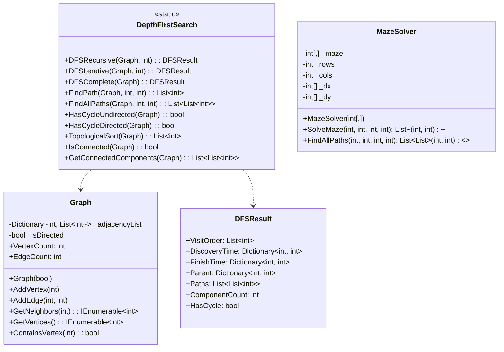

# 架构文档

本文档概述了DFS项目的体系结构。

## 类图

## 类说明

### `Graph.cs`

`Graph` 类使用邻接表表示图形数据结构。它可用于创建有向图和无向图。它提供了添加顶点和边以及检索有关图形信息的方法。

### `DFSResult.cs`

`DFSResult` 类是一个数据容器，用于存储深度优先搜索遍历的结果。这包括访问顶点的顺序、发现和完成时间、父指针以及找到的任何路径。

### `DepthFirstSearch.cs`

这是一个静态类，包含深度优先搜索算法的各种实现。其中包括DFS的递归和迭代版本，以及用于查找路径、检测周期、执行拓扑排序和查找连接组件的方法。

### `MazeSolver.cs`

`MazeSolver` 类提供了DFS算法在解决迷宫问题中的实际应用。它可以在基于网格的迷宫中找到从起点到终点的单条路径或所有可能路径。